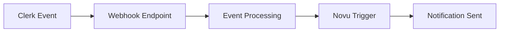

# Clerk Webhook Integration with Novu Notifications

This guide demonstrates how to integrate Clerk webhooks with Novu notifications in a Next.js application. You'll learn how to automatically trigger notification workflows when Clerk events occur, such as user creation or email events.

## Overview

When certain events happen in Clerk (like user signup or password changes), this integration will:
1. Receive the webhook event from Clerk
2. Verify the webhook signature
3. Process the event data
4. Trigger appropriate Novu notification workflows

## **Before you start**

* [A Clerk + Next.js app is required.](https://clerk.com/docs/quickstarts/nextjs)
* [A ngrok account is required.](https://dashboard.ngrok.com/signup)
* [A Novu account is required.](https://novu.com/signup)

The recommended way to sync Clerk data to your app is through webhooks.

In this guide, you'll set up a webhook in your Next.js app to listen for the `user.created` and `email.created` events, create an endpoint in the Clerk Dashboard, build a handler, and test it locally using ngrok, the Clerk Dashboard and Novu.

These steps apply to any Clerk event. To make the setup process easier, it's recommended to keep two browser tabs open: one for your Clerk [**Webhooks**](https://dashboard.clerk.com/last-active?path=webhooks) page and one for your [ngrok dashboard](https://dashboard.ngrok.com/).

## Architecture



## Installation

1. Install required dependencies:

```bash
npm install svix @novu/api
```

2. Configure environment variables:

```env
NEXT_PUBLIC_CLERK_PUBLISHABLE_KEY=pk_test_...
CLERK_SECRET_KEY=sk_test_...
SIGNING_SECRET=whsec_...
NOVU_SECRET_KEY=...
```

## [**Set up ngrok**](https://clerk.com/docs/webhooks/sync-data#set-up-ngrok)

To test a webhook locally, you need to expose your local server to the internet. This guide uses [ngrok](https://ngrok.com/) which creates a **forwarding URL** that sends the webhook payload to your local server.

1. Navigate to the [ngrok dashboard](https://dashboard.ngrok.com/) to create an account.
2. On the ngrok dashboard homepage, follow the [setup guide](https://dashboard.ngrok.com/get-started/setup) instructions. Under **Deploy your app online**, select **Static domain**. Run the provided command, replacing the port number with your server's port. For example, if your development server runs on port 3000, the command should resemble `ngrok http --url=<YOUR_FORWARDING_URL> 3000`. This creates a free static domain and starts a tunnel.
3. Save your **Forwarding** URL somewhere secure.

## [**Set up a webhook endpoint**](https://clerk.com/docs/webhooks/sync-data#set-up-a-webhook-endpoint)

1. In the Clerk Dashboard, navigate to the [**Webhooks**](https://dashboard.clerk.com/last-active?path=webhooks) page.
2. Select **Add Endpoint**.
3. In the **Endpoint URL** field, paste the ngrok **Forwarding** URL you saved earlier, followed by `/api/webhooks`. This is the endpoint that Svix uses to send the webhook payload. The full URL should resemble `https://fawn-two-nominally.ngrok-free.app/api/webhooks`.
4. In the **Subscribe to events** section, scroll down and select `user.created`.
5. Select **Create**. You'll be redirected to your endpoint's settings page. Keep this page open.

## [**Add your Signing Secret to `.env.local` **](https://clerk.com/docs/webhooks/sync-data#add-your-signing-secret-to-env-local)

To verify the webhook payload, you'll need your endpoint's **Signing Secret**. 

Since you don't want this secret exposed in your codebase, store it as an environment variable in your `.env` file during local development.

1. On the endpoint's settings page in the Clerk Dashboard, copy the **Signing Secret**. You may need to select the eye icon to reveal the secret.
2. In your project's root directory, open or create an `.env` file, which should already include your Clerk API keys. Assign your **Signing Secret** to `SIGNING_SECRET`. The file should resemble:
3. 

```markdown
NEXT_PUBLIC_CLERK_PUBLISHABLE_KEY=
CLERK_SECRET_KEY=
SIGNING_SECRET=
NOVU_SECRET_KEY=
```

## [**Set the webhook route as public in your Middleware**](https://clerk.com/docs/webhooks/sync-data#set-the-webhook-route-as-public-in-your-middleware)

Incoming webhook events don't contain auth information. They come from an external source and aren't signed in or out, so the route must be public to allow access. If you're using `clerkMiddleware()` , ensure that the `/api/webhooks(.*)` route is set as public. For information on configuring routes, see the [ `clerkMiddleware()` guide](https://clerk.com/docs/references/nextjs/clerk-middleware).

## [**Install `svix` **](https://clerk.com/docs/webhooks/sync-data#install-svix)

Clerk uses [ `svix` ](https://www.npmjs.com/package/svix) to deliver webhooks, so you'll use it to verify the webhook signature. Run the following command in your terminal to install the package:

```markdown
npm install svix
```

## [Create the endpoints](https://clerk.com/docs/webhooks/sync-data#create-the-endpoint)

### Clerk:

Set up a Route Handler that uses `svix` to verify the incoming Clerk webhook and process the payload.

For example, if listening for the `user.created` event, you might perform a database `create` or `upsert` to add the user's Clerk data to your database's user table.

If the route handler returns a [4xx](https://developer.mozilla.org/en-US/docs/Web/HTTP/Status#client_error_responses) or [5xx code](https://developer.mozilla.org/en-US/docs/Web/HTTP/Status#server_error_responses), or no code at all, the webhook event will be [retried](https://clerk.com/docs/webhooks/overview#retry). If the route handler returns a [2xx code](https://developer.mozilla.org/en-US/docs/Web/HTTP/Status#successful_responses), the event will be marked as successful, and retries will stop.

<aside>


**Note** The following Route Handler can be used for any webhook event you choose to listen to.

</aside>

```jsx
// app/api/auth/route.ts

import { Webhook } from 'svix'
import { headers } from 'next/headers'
import { WebhookEvent } from '@clerk/nextjs/server'
import { triggerWorkflow } from '../notifications/route'

export async function POST(req: Request) {
    const SIGNING_SECRET = process.env.SIGNING_SECRET

    if (!SIGNING_SECRET) {
        throw new Error('Error: Please add SIGNING_SECRET from Clerk Dashboard to .env or .env.local')
    }

    // Create new Svix instance with secret
    const wh = new Webhook(SIGNING_SECRET)

    // Get headers
    const headerPayload = await headers()
    const svix_id = headerPayload.get('svix-id')
    const svix_timestamp = headerPayload.get('svix-timestamp')
    const svix_signature = headerPayload.get('svix-signature')

    // If there are no headers, error out
    if (!svix_id || !svix_timestamp || !svix_signature) {
        return new Response('Error: Missing Svix headers', {
            status: 400,
        })
    }

    // Get body
    const payload = await req.json()
    const body = JSON.stringify(payload)

    let evt: WebhookEvent

    // Verify payload with headers
    try {
        evt = wh.verify(body, {
            'svix-id': svix_id,
            'svix-timestamp': svix_timestamp,
            'svix-signature': svix_signature,
        }) as WebhookEvent
    } catch (err) {
        console.error('Error: Could not verify webhook:', err)
        return new Response('Error: Verification error', {
            status: 400,
        })
    }

    // Event handling

    if (evt.type === 'user.created') {
        console.log('userId:', evt.data.id, 'event:', evt.type)
        const data = evt.data;
        console.log('Clerk webhook data:', data);
        const subscriber = {
            subscriberId: 'clerk_' + (data.email_addresses[0].email_address || ''),
            firstName: data.first_name || '',
            lastName: data.last_name || '',
            email: data.email_addresses[0].email_address || '',
            phone: data.phone_numbers?.[0]?.phone_number || '',
            locale: `en_US`, //default locale
            avatar: data.image_url || '',
            data: {
                clerkCreatedAt: data.created_at || '',
                lastSignInAt: data.last_sign_in_at || '',
                clerkUpdatedAt: data.updated_at || '',
                username: data.username || '',
                clerkUserId: data.id || '',
            }
        };
        const payload = {};
        try {
            await triggerWorkflow('clerk-user-created', subscriber as any, payload as any);
            console.log('Novu trigger successful');
        } catch (error) {
            console.error('Failed to trigger Novu workflow:', error);
        }
    }

    if (evt.type === 'user.updated') {
        console.log('userId:', evt.data.id)
    }

    if (evt.type === 'user.deleted') {
        console.log('userId:', evt.data.id)
    }
    
    // Email events (verification_code, password_changed, magic_link_sign_in, reset_password_code, organization_invitation, invitation)
    if (evt.type === 'email.created') {
        const data = evt.data;
        const subscriber = {
            subscriberId: 'clerk_' + (data.to_email_address || ''),
            email: data.to_email_address || '',
        };

        if (data.slug === 'verification_code' && data.data) {
            const payload = {
                body: {
                    data: {
                        subject: data.subject || '',
                        otp_code: data.data.otp_code || '',
                        app: {
                            name: data.data.app.name || ''
                        },
                        requested_by: data.data.requested_by || '',
                        requested_from: data.data.requested_from || '',
                        requested_at: data.data.requested_at || '',
                        device: data.data.requested_by || ''
                    }
                }
            };
            await triggerWorkflow('clerk-verification-code', subscriber as any, payload as any);
        }
        if (data.slug === 'password_changed' && data.data) {
            const payload = {
                body: {
                    data: {
                        subject: data.subject || '',
                        greeting_name: data.data.greeting_name || '',
                        primary_email_address: data.data.primary_email_address || '',
                        app: {
                            name: data.data.app.name || ''
                        },
                        requested_by: data.data.requested_by || '',
                        requested_from: data.data.requested_from || '',
                        requested_at: data.data.requested_at || '',
                        device: data.data.requested_by || ''
                    }
                }
            };
            await triggerWorkflow('clerk-password-changed', subscriber as any, payload as any);
        }
        if (data.slug === 'magic_link_sign_in' && data.data) {
            const payload = {
                body: {
                    data: {
                        subject: data.subject || '',
                        magic_link: data.data.magic_link || '',
                        app: {
                            name: data.data.app.name || ''
                        },
                        ttl_minutes: data.data.ttl_minutes || '',
                        requested_by: data.data.requested_by || '',
                        requested_from: data.data.requested_from || '',
                        requested_at: data.data.requested_at || '',
                        device: data.data.requested_by || ''
                    }
                }
            };
            await triggerWorkflow('clerk-magic-link-sign-in', subscriber as any, payload as any);
        }
        if (data.slug === 'reset_password_code' && data.data) {
            const payload = {
                body: {
                    data: {
                        subject: data.subject || '',
                        otp_code: data.data.otp_code || '',
                        app: {
                            name: data.data.app.name || ''
                        },
                        requested_by: data.data.requested_by || '',
                        requested_from: data.data.requested_from || '',
                        requested_at: data.data.requested_at || '',
                        device: data.data.requested_by || ''
                    }
                }
            };
            await triggerWorkflow('clerk-reset-password-code', subscriber as any, payload as any);
        }
        if (data.slug === 'organization_invitation' && data.data) {
            const payload = {
                body: {
                    data: {
                        subject: data.subject || '',
                        inviter_name: data.data.inviter_name || '',
                        org_name: data.data.org.name || '',
                        app: {
                            name: data.data.app.name || ''
                        },
                        action_url: data.data.action_url || '',
                        requested_by: data.data.requested_by || '',
                        requested_from: data.data.requested_from || '',
                        requested_at: data.data.requested_at || '',
                        device: data.data.requested_by || ''
                    }
                }
            };
            await triggerWorkflow('clerk-organization-invitation', subscriber as any, payload as any);
        }
        if (data.slug === 'invitation' && data.data) {
            const payload = {
                body: {
                    data: {
                        subject: data.subject || '',
                        otp_code: data.data.otp_code || '',
                        app: {
                            name: data.data.app.name || ''
                        },
                        requested_by: data.data.requested_by || '',
                        requested_from: data.data.requested_from || '',
                        requested_at: data.data.requested_at || '',
                        device: data.data.requested_by || ''
                    }
                }
            };
            await triggerWorkflow('clerk-invitation', subscriber as any, payload as any);
        }
    }

    return new Response('Webhook received', { status: 200 })
}
```

### Novu

```jsx
// app/api/notifications/route.ts

import { Novu } from '@novu/api';

const novu = new Novu({
    secretKey: process.env['NOVU_SECRET_KEY']
});

export async function triggerWorkflow(workflow: string, subscriber: object, payload: object) {
    try {
        await novu.trigger({
            workflowId: workflow,
            to: subscriber as any,
            payload: payload as any
        });
        return new Response(JSON.stringify({ message: 'Notification triggered successfully' }), { status: 200 });
    } catch (error) {
        console.error('Error triggering notification:', error);
        return new Response(JSON.stringify({ message: 'Failed to trigger notification' }), { status: 500 });
    }
}
```

## [**Narrow to a webhook event for type inference**](https://clerk.com/docs/webhooks/sync-data#narrow-to-a-webhook-event-for-type-inference)

`WebhookEvent` encompasses all possible webhook types. Narrow down the event type for accurate typing for specific events.

In the following example, the `if` statement narrows the type to `user.created` , enabling type-safe access to evt.data with autocompletion.

```jsx
if (evt.type === 'user.created') {
  console.log('userId:', evt.data.id)
}
```

## [**Test the webhook**](https://clerk.com/docs/webhooks/sync-data#test-the-webhook)

1. Start your Next.js server.
2. In your endpoint's settings page in the Clerk Dashboard, select the **Testing** tab.
3. In the **Select event** dropdown, select `user.created`.
4. Select **Send Example**.
5. In the **Message Attempts** section, confirm that the event's **Status** is labeled with **Succeeded**.

### [**Handling failed messages**](https://clerk.com/docs/webhooks/sync-data#handling-failed-messages)

1. In the **Message Attempts** section, select the event whose **Status** is labeled with **Failed**.
2. Scroll down to the **Webhook Attempts** section.
3. Toggle the arrow next to the **Status** column.
4. Review the error. Solutions vary by error type. For more information, refer to the [Debug your webhooks](https://clerk.com/docs/webhooks/debug-your-webhooks) guide.

## [**Trigger the webhook**](https://clerk.com/docs/webhooks/sync-data#trigger-the-webhook)

To trigger the `user.created` event, create a new user in your app.

You should be able to see the webhook's payload logged to your terminal where your app is running. You can also check the Clerk Dashboard to see the webhook attempt, the same way you did when [testing the webhook](https://clerk.com/docs/webhooks/sync-data#test-the-webhook).

## Novu Workflow Setup

1. Create the following workflows in your Novu dashboard:
   - `clerk-user-created`

   - `clerk-verification-code`

   - `clerk-password-changed`

   - `clerk-magic-link-sign-in`

   - `clerk-reset-password-code`

   - `clerk-organization-invitation`

   - `clerk-invitation`

2. Configure each workflow with appropriate templates and channels (email, SMS, etc.)

## Troubleshooting

Common issues and solutions:

1. Webhook verification fails
   - Double-check your `SIGNING_SECRET` in .env
   - Ensure headers are being passed correctly

2. Novu triggers fail
   - Verify your `NOVU_SECRET_KEY`

   - Check workflow IDs match exactly
   - Confirm subscriber data format

3. ngrok connection issues
   - Ensure your ngrok tunnel is running
   - Verify the forwarding URL in Clerk matches your ngrok URL

## Security Considerations

* Always verify webhook signatures
* Store secrets securely in environment variables
* Set appropriate middleware protections
* Monitor webhook logs for unusual activity
